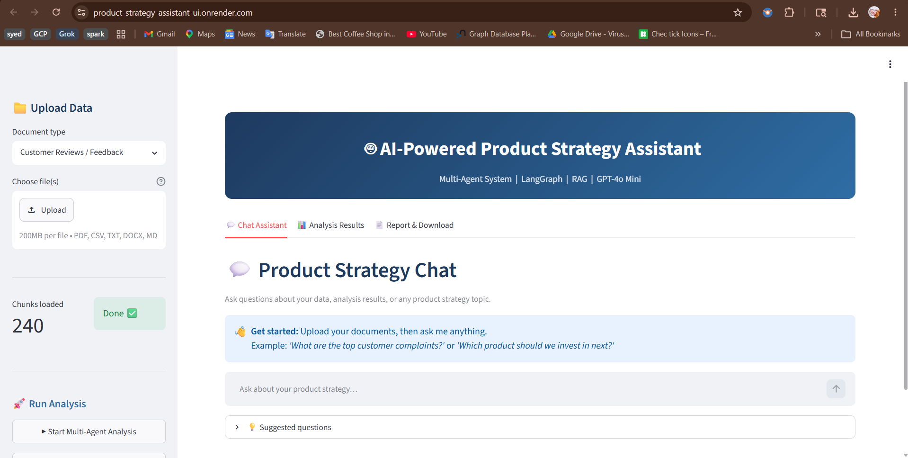
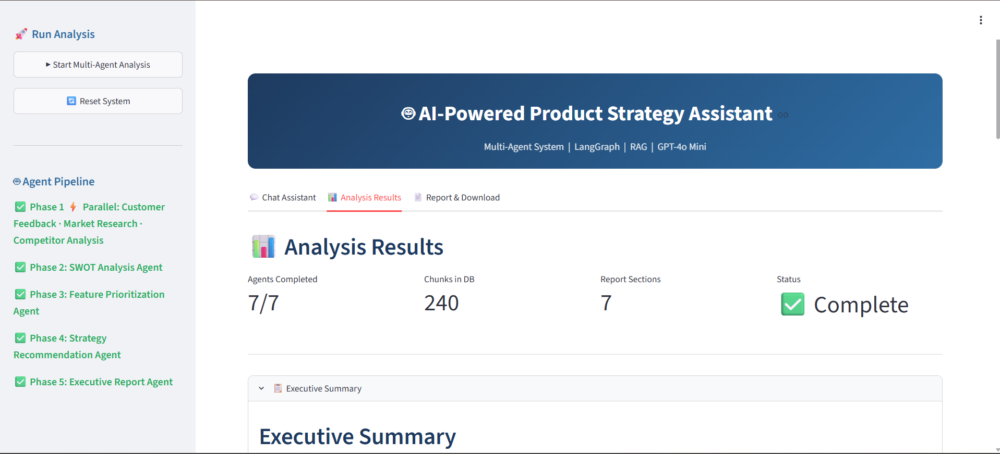
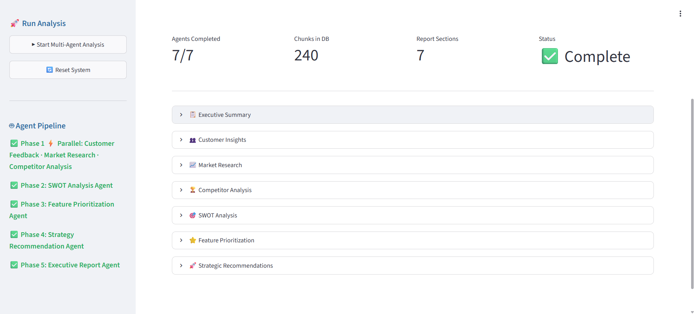
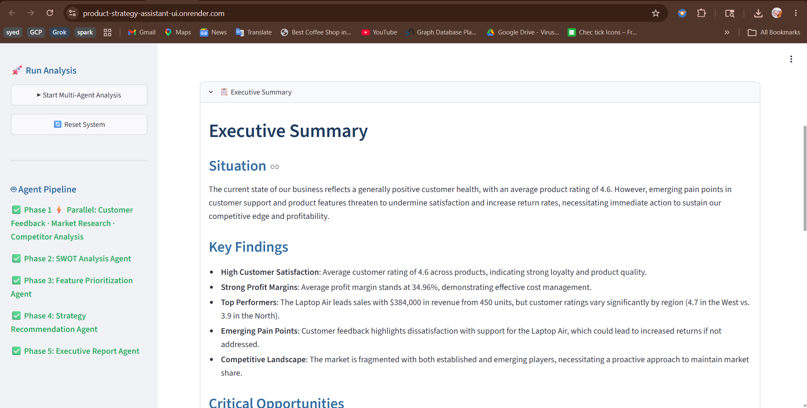
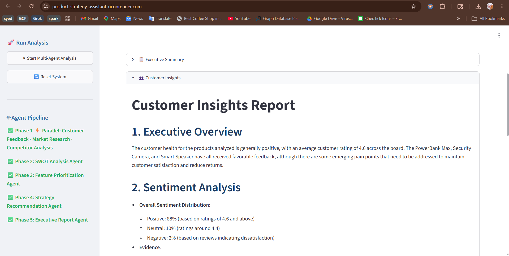
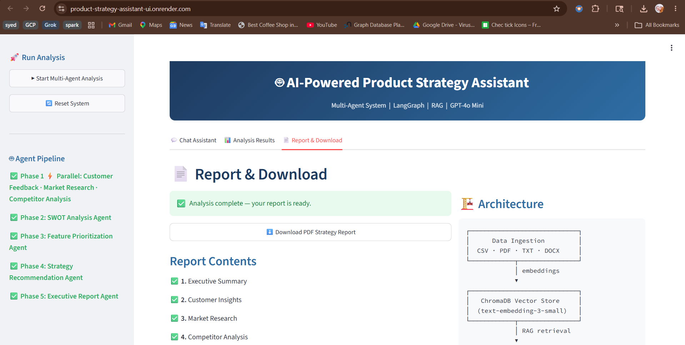

# AI-Powered Product Strategy Assistant

> A multi-agent AI system that transforms raw business data into actionable product strategy insights — built with LangGraph, FastAPI, ChromaDB, and Streamlit.

---

## Table of Contents

1. [Overview](#overview)
2. [Key Features](#key-features)
3. [System Architecture](#system-architecture)
4. [Agent Pipeline](#agent-pipeline)
5. [Tech Stack](#tech-stack)
6. [Project Structure](#project-structure)
7. [Getting Started](#getting-started)
8. [How to Use the App](#how-to-use-the-app)
9. [Application Screenshots](#application-screenshots)
10. [Supported Input Formats](#supported-input-formats)
11. [Expected Outputs](#expected-outputs)
12. [API Reference](#api-reference)
13. [Configuration Reference](#configuration-reference)
14. [Evaluation Criteria Coverage](#evaluation-criteria-coverage)
15. [Bonus Features](#bonus-features)

---

## Overview

Product Managers spend significant time manually reviewing customer feedback, sales data, market research, and competitor reports before making strategic decisions. This process is slow, inconsistent, and hard to scale.

The **AI-Powered Product Strategy Assistant** solves this by:

- Ingesting structured and unstructured business documents (CSV, PDF, TXT, DOCX)
- Routing them through a **7-agent LangGraph pipeline**, where each agent specialises in a different analysis dimension
- Synthesising all findings into a **comprehensive strategy report**
- Exposing an **interactive RAG-powered chat interface** for natural language Q&A over the data
- Generating a **downloadable PDF report** for stakeholder sharing

---

## Key Features

| Feature | Description |
|---|---|
| Multi-Agent Analysis | 7 specialised AI agents collaborate sequentially via LangGraph |
| RAG-Powered Chat | Ask questions in plain English; answers are grounded in your uploaded data |
| Document Ingestion | Supports CSV, PDF, TXT, DOCX, and Markdown |
| Local Embeddings | ChromaDB with built-in ONNX MiniLM — no embedding API calls required |
| PDF Report | Professional, multi-section downloadable report via ReportLab |
| Interactive UI | Clean Streamlit interface with live agent progress tracking |
| REST API | Full FastAPI backend with Swagger UI at `/docs` |
| One-click Start | `start.bat` launches both servers in separate terminals |

---

## System Architecture

```
┌─────────────────────────────────────────────────────────────────────────┐
│                          USER INTERFACE (Streamlit)                     │
│         Upload Docs │ Chat Assistant │ Analysis Results │ PDF Download  │
└────────────────────────────────┬────────────────────────────────────────┘
                                 │ HTTP (REST)
                                 ▼
┌─────────────────────────────────────────────────────────────────────────┐
│                         FASTAPI BACKEND (:8000)                         │
│  /api/upload  /api/analyze  /api/results  /api/chat  /api/report/download│
└───────────┬─────────────────────────────────────────────┬───────────────┘
            │                                             │
            ▼                                             ▼
┌───────────────────────────┐               ┌─────────────────────────────┐
│   DOCUMENT PROCESSOR      │               │   LANGGRAPH ORCHESTRATOR    │
│                           │               │                             │
│  PDF / CSV / TXT / DOCX   │               │  7-Agent Sequential Pipeline│
│          ↓                │               │  + RAG Chat Node            │
│  RecursiveCharacterSplitter│               └──────────────┬──────────────┘
│          ↓                │                              │
│  Chunked Documents        │                              │ LLM Calls
└───────────┬───────────────┘                              ▼
            │ embed_documents()              ┌─────────────────────────────┐
            ▼                               │  GPT-4o Mini via Gateway    │
┌───────────────────────────┐               │  https://keygateway...com/v1│
│   CHROMADB VECTOR STORE   │               └─────────────────────────────┘
│                           │
│  Local ONNX MiniLM        │◄── similarity_search() ── Agent RAG Retrieval
│  Embeddings (offline)     │
└───────────────────────────┘
```

**Key design decision — split embedding strategy:**
- **Document ingestion** uses ChromaDB's built-in local ONNX model (no API key, no network call, always works)
- **LLM inference** (all agent reasoning + chat) routes through the OpenAI-compatible gateway

---

## Agent Pipeline

The analysis runs as a **directed acyclic graph** compiled by LangGraph. Each node is a specialised agent that retrieves relevant context from the vector store and calls the LLM.

```
START
  │
  ├─(mode = "analyze")──────────────────────────────────────────────┐
  │                                                                  │
  │   ┌─────────────────────────────────────────────────────────┐   │
  │   │                  ANALYSIS PIPELINE                      │   │
  │   │                                                         │   │
  │   │  [1] Customer Feedback Agent                            │   │
  │   │       • Sentiment analysis & rating trends              │   │
  │   │       • Top pain points & complaints (Top 5)            │   │
  │   │       • Most-requested features                         │   │
  │   │       • At-risk customer signals                        │   │
  │   │              ↓                                          │   │
  │   │  [2] Market Research Agent                              │   │
  │   │       • Revenue & profitability trends                  │   │
  │   │       • Best/worst performing products & regions        │   │
  │   │       • Marketing ROI analysis                          │   │
  │   │       • Growth opportunities                            │   │
  │   │              ↓                                          │   │
  │   │  [3] Competitor Analysis Agent                          │   │
  │   │       • Competitive landscape mapping                   │   │
  │   │       • Competitor strengths & weaknesses               │   │
  │   │       • Feature & positioning gaps                      │   │
  │   │       • Differentiation recommendations                 │   │
  │   │              ↓                                          │   │
  │   │  [4] SWOT Analysis Agent  ← synthesises [1][2][3]      │   │
  │   │       • 5–7 items per quadrant, all data-backed         │   │
  │   │       • SO / ST / WO / WT strategic implications        │   │
  │   │              ↓                                          │   │
  │   │  [5] Feature Prioritization Agent                       │   │
  │   │       • RICE scoring & MoSCoW classification            │   │
  │   │       • Priority Tier 1–4 with rationale                │   │
  │   │       • Quick-win identification                        │   │
  │   │              ↓                                          │   │
  │   │  [6] Strategy Recommendation Agent                      │   │
  │   │       • 12-month strategic vision                       │   │
  │   │       • Q1–Q4 product roadmap                           │   │
  │   │       • 30 / 60 / 90 day action plan                    │   │
  │   │       • KPIs & success metrics                          │   │
  │   │              ↓                                          │   │
  │   │  [7] Executive Report Agent                             │   │
  │   │       • C-suite executive summary (≤600 words)          │   │
  │   │       • Key findings, opportunities, risks              │   │
  │   │       • Immediate action items                          │   │
  │   └─────────────────────────────────────────────────────────┘   │
  │                              ↓                                   │
  │                             END                                  │
  │                                                                  │
  └─(mode = "chat")──► [RAG Chat Node] ──► END                      │
                         • Retrieves top-K chunks from ChromaDB      │
                         • Injects completed agent outputs as context│
                         • Answers with grounded, cited responses    │
```

---

## Tech Stack

| Layer | Technology | Purpose |
|---|---|---|
| LLM Inference | GPT-4o Mini (via gateway) | All agent reasoning and chat |
| Embeddings | ChromaDB ONNX MiniLM (local) | Document vectorisation, no API key needed |
| Agent Framework | LangGraph 0.2.x | Stateful multi-agent graph orchestration |
| LLM Integration | LangChain + langchain-openai | LLM client, prompt management |
| Vector Database | ChromaDB 0.5.x | Persistent similarity search |
| Backend | FastAPI + Uvicorn | REST API server |
| Frontend | Streamlit | Interactive chat & analysis UI |
| PDF Generation | ReportLab | Professional formatted report |
| Document Parsing | LangChain Community Loaders | PDF, CSV, DOCX, TXT ingestion |
| Text Splitting | LangChain Text Splitters | Recursive character chunking |
| HTTP Client | httpx | OpenAI SDK transport layer |

---

## Project Structure

```
ProductStrategistAssistant/
│
├── backend/                            # FastAPI application
│   ├── main.py                         # API server — 8 REST endpoints
│   ├── config.py                       # Centralised env-var config
│   │
│   ├── agents/                         # One file per agent
│   │   ├── base_agent.py               # Shared LLM client + vector store
│   │   ├── customer_feedback_agent.py  # Agent 1 — sentiment & pain points
│   │   ├── market_research_agent.py    # Agent 2 — sales & market trends
│   │   ├── competitor_analysis_agent.py# Agent 3 — competitive landscape
│   │   ├── swot_analysis_agent.py      # Agent 4 — SWOT synthesis
│   │   ├── feature_prioritization_agent.py  # Agent 5 — RICE/MoSCoW
│   │   ├── strategy_recommendation_agent.py # Agent 6 — action plan
│   │   └── executive_report_agent.py   # Agent 7 — executive summary
│   │
│   ├── orchestrator/
│   │   └── workflow.py                 # LangGraph StateGraph definition
│   │
│   ├── vector_store/
│   │   └── chroma_store.py             # ChromaDB singleton wrapper
│   │
│   └── utils/
│       ├── document_processor.py       # File ingestion & chunk splitting
│       └── pdf_generator.py            # ReportLab PDF builder
│
├── frontend/
│   └── app.py                          # Streamlit UI (3 tabs)
│
├── data/                               # Place sample data files here
│   └── Sample Sales Data.csv           # Included example dataset
│
├── .env                                # Your local secrets (git-ignored)
├── .env.example                        # Template — copy to .env
├── requirements.txt                    # All Python dependencies
├── start.bat                           # Windows one-click launcher
└── README.md
```

---

## Getting Started

### Prerequisites

- Python **3.10** or higher
- `pip` package manager
- An OpenAI-compatible API key (e.g., `learner005` for the Arshniv Labs gateway)

---

### Step 1 — Clone / navigate to the project

```bash
cd "c:\Course Files\FDE\Assessment\ProductStrategistAssistant"
```

---

### Step 2 — Install dependencies

```bash
pip install -r requirements.txt
```

This installs all required packages including LangGraph, LangChain, ChromaDB, FastAPI, Streamlit, and ReportLab.

---

### Step 3 — Configure the environment

Copy the example file and fill in your credentials:

```bash
# Windows
copy .env.example .env
```

Open `.env` and set the following values:

```env
# Required
OPENAI_API_KEY=your_api_key_here
OPENAI_BASE_URL=https://keygateway.arshnivlabs.com/v1

# Optional — defaults are pre-configured
LLM_MODEL=gpt-4o-mini
EMBEDDING_MODEL=text-embedding-3-small
CHROMA_PERSIST_DIR=./chroma_db
TEMPERATURE=0.3
MAX_TOKENS=2000
BACKEND_URL=http://localhost:8000
```

> **Note:** The `OPENAI_BASE_URL` must include `/v1` at the end. The gateway uses a self-signed SSL certificate — the application handles this automatically (`verify=False` is configured in the HTTP client).

---

### Step 4 — Start the application

**Option A — One-click (Windows)**

```
Double-click  start.bat
```

This opens two terminal windows: one for the backend and one for the frontend.

**Option B — Manual (two separate terminals)**

Terminal 1 — Backend API:
```bash
cd backend
python main.py
```
Backend runs at: `http://localhost:8000`
Swagger UI at: `http://localhost:8000/docs`

Terminal 2 — Frontend UI:
```bash
cd frontend
streamlit run app.py
```
Frontend runs at: `http://localhost:8501`

---

## How to Use the App

Open **http://localhost:8501** in your browser.

### Step 1 — Upload your data

Use the **sidebar** to upload business documents:

1. Select the document type from the dropdown (e.g., *Sales Data / Analytics*, *Customer Reviews*, *Market Research*)
2. Upload one or more files (CSV, PDF, TXT, DOCX)
3. Each file is processed, chunked, and embedded into ChromaDB — a success message confirms how many chunks were created

> The included `Sample Sales Data.csv` contains electronics product sales data across multiple regions — upload it as *Sales Data / Analytics* to try the system immediately.

### Step 2 — Run the multi-agent analysis

Click **▶ Start Multi-Agent Analysis** in the sidebar.

The 7 agents run **sequentially** — each agent's output is shared with the next. The sidebar shows live status badges (⬜ pending → ⏳ running → ✅ done) for each agent.

Typical analysis time: **2–4 minutes** depending on data volume.

### Step 3 — Explore the results

Navigate to the **Analysis Results** tab to view each agent's output in expandable sections:

| Section | What you'll find |
|---|---|
| Executive Summary | C-suite overview, key findings, and recommended actions |
| Customer Insights | Sentiment breakdown, top pain points, feature requests |
| Market Research | Revenue trends, regional performance, growth opportunities |
| Competitor Analysis | Competitive landscape, gaps, differentiation strategies |
| SWOT Analysis | Strengths/Weaknesses/Opportunities/Threats with implications |
| Feature Priorities | RICE/MoSCoW tiers, quick wins, prioritisation rationale |
| Strategic Recommendations | 30/60/90 day plan, roadmap, KPIs |

### Step 4 — Chat with your data

Go to the **Chat Assistant** tab to ask questions in plain English:

- *"What are the top 3 customer pain points?"*
- *"Which product has the best profit margin?"*
- *"What should we build in Q2?"*
- *"How does our performance compare across regions?"*

The assistant retrieves relevant document chunks from ChromaDB and uses completed agent analysis as additional context, ensuring grounded, data-backed answers.

### Step 5 — Download the PDF report

Go to the **Report & Download** tab and click **⬇ Download PDF Strategy Report**.

The PDF includes all seven analysis sections with a cover page, table of contents, and professional formatting.

---

## Application Screenshots

### Chat Assistant



The RAG-powered chat interface. After uploading documents, ask natural language questions about your data. Suggested prompts help new users get started, and the sidebar confirms how many chunks are indexed and ready for analysis.

---

### Analysis Results — Status Dashboard



The Analysis Results tab immediately after a completed run. The status dashboard confirms all 7 agents have finished, shows the number of document chunks indexed (240), the number of report sections generated (7), and marks the overall status as **Complete**. The sidebar lists all agent pipeline phases with green check marks.

---

### Analysis Results — All Sections



All seven collapsible report sections displayed at a glance: Executive Summary, Customer Insights, Market Research, Competitor Analysis, SWOT Analysis, Feature Prioritization, and Strategic Recommendations. Each section can be expanded independently to read the full agent output.

---

### Executive Summary — Expanded



The Executive Summary section expanded, showing the **Situation** overview and **Key Findings** — including average customer satisfaction scores, profit margin analysis, emerging pain points, and competitive landscape highlights — all derived from the uploaded data.

---

### Customer Insights Report — Expanded



The Customer Insights Report section expanded, displaying the Executive Overview and a **Sentiment Analysis** breakdown (positive / neutral / negative percentages) backed by the uploaded customer review data.

---

### Report & Download



The Report & Download tab once analysis is complete. A single button downloads the full multi-section PDF report. The right-hand panel shows the system architecture diagram illustrating the data ingestion, ChromaDB vector store, and RAG retrieval flow.

---

## Supported Input Formats

| Format | Extension | Typical Use Case |
|---|---|---|
| CSV | `.csv` | Sales data, product analytics, feature request lists |
| PDF | `.pdf` | Market research reports, competitor documents |
| Plain Text | `.txt` | Customer reviews, survey responses |
| Word Document | `.docx` | Business documents, internal reports |
| Markdown | `.md` | Product specs, internal notes |

Files are split into **1,000-character chunks with 200-character overlap** using LangChain's `RecursiveCharacterTextSplitter`. Chunks are tagged with their source filename and document type for filtered retrieval.

---

## Expected Outputs

### Analysis Sections (displayed in-app and in PDF)

| # | Output | Contents |
|---|---|---|
| 1 | **Executive Summary** | Situation, key findings, critical opportunities, recommended actions |
| 2 | **Customer Insights Report** | Sentiment analysis, top pain points, feature requests, at-risk signals |
| 3 | **Market Research Summary** | Revenue/profit trends, regional breakdown, marketing ROI, growth levers |
| 4 | **Competitor Analysis Report** | Competitive landscape, strengths/gaps, differentiation recommendations |
| 5 | **SWOT Analysis** | 5–7 items per quadrant with SO/ST/WO/WT strategic implications |
| 6 | **Feature Prioritization** | RICE scoring, MoSCoW tiers (Must/Should/Could/Won't), quick wins |
| 7 | **Strategic Action Plan** | 12-month vision, Q1–Q4 roadmap, 30/60/90 day plan, KPIs |

### Downloadable Artifact

- **PDF Report** — professionally formatted with cover page, table of contents, and all 7 sections

---

## API Reference

The FastAPI backend exposes a full REST API. Interactive documentation is available at **http://localhost:8000/docs**.

| Method | Endpoint | Description |
|---|---|---|
| `GET` | `/` | Health check — confirms the server is running |
| `GET` | `/api/status` | Returns analysis status, document count, current agent step |
| `POST` | `/api/upload` | Upload a document file; accepts `file` (multipart) and `doc_type` (form field) |
| `POST` | `/api/analyze` | Kick off the 7-agent analysis pipeline (runs in background) |
| `GET` | `/api/results` | Retrieve all agent outputs once analysis is complete |
| `POST` | `/api/chat` | Send a chat message; accepts `{ "query": "...", "chat_history": [...] }` |
| `GET` | `/api/report/download` | Stream the full analysis as a PDF file |
| `DELETE` | `/api/reset` | Clear all uploaded documents and analysis results |

### Example — Upload a document

```bash
curl -X POST http://localhost:8000/api/upload \
  -F "file=@Sample Sales Data.csv" \
  -F "doc_type=sales_data"
```

### Example — Send a chat message

```bash
curl -X POST http://localhost:8000/api/chat \
  -H "Content-Type: application/json" \
  -d '{"query": "Which product has the highest revenue?", "chat_history": []}'
```

---

## Configuration Reference

All settings are loaded from the `.env` file in the project root.

| Variable | Default | Description |
|---|---|---|
| `OPENAI_API_KEY` | *(required)* | API key for the LLM gateway |
| `OPENAI_BASE_URL` | `https://keygateway.arshnivlabs.com/v1` | Base URL for the OpenAI-compatible gateway (must include `/v1`) |
| `LLM_MODEL` | `gpt-4o-mini` | Model used for all agent LLM calls |
| `EMBEDDING_MODEL` | `text-embedding-3-small` | Model name reference (embeddings run locally) |
| `CHROMA_PERSIST_DIR` | `./chroma_db` | Directory where ChromaDB persists vector data |
| `CHUNK_SIZE` | `1000` | Character size of each document chunk |
| `CHUNK_OVERLAP` | `200` | Overlap between consecutive chunks |
| `MAX_RETRIEVAL_DOCS` | `5` | Number of chunks retrieved per RAG query |
| `TEMPERATURE` | `0.3` | LLM sampling temperature (lower = more deterministic) |
| `MAX_TOKENS` | `2000` | Maximum tokens per LLM response |
| `BACKEND_URL` | `http://localhost:8000` | Backend URL used by the Streamlit frontend |

---

## Evaluation Criteria Coverage

| Criterion | Weight | Implementation |
|---|---|---|
| **Successful Deployment** | 30% | FastAPI + Streamlit running locally; one-click `start.bat`; Swagger UI at `/docs` |
| **Quality of AI Insights** | 35% | 7 specialised agents with domain-specific prompts; RAG grounding from uploaded data; structured output format per agent |
| **Multi-Agent Design & UX** | 35% | LangGraph `StateGraph` with typed shared state; agents share outputs downstream; live progress indicators in Streamlit |

---

## Bonus Features

| Feature | Status | Details |
|---|---|---|
| Advanced Multi-Agent Collaboration | ✅ Implemented | Each agent receives outputs from all upstream agents as context |
| Product Opportunity Scoring | ✅ Implemented | RICE scoring (Reach × Impact × Confidence ÷ Effort) in Feature Prioritization Agent |
| Roadmap Generation | ✅ Implemented | Q1–Q4 product roadmap in Strategy Recommendation Agent |
| Downloadable PDF Report | ✅ Implemented | Cover page, table of contents, 7 sections via ReportLab |
| Interactive Chat (RAG) | ✅ Implemented | LangGraph chat node with ChromaDB retrieval + analysis context |
| 30/60/90 Day Action Plan | ✅ Implemented | Detailed phased action plan in Strategy Recommendation Agent |
| Executive Presentation | ✅ Implemented | C-suite executive summary in Executive Report Agent |

---

## Troubleshooting

**Backend server not detected in Streamlit**
- Ensure `python main.py` is running in the `backend/` directory
- Check that port 8000 is not in use by another application

**"No documents uploaded" error when starting analysis**
- Upload at least one file via the sidebar before clicking Start Analysis

**Analysis is slow**
- Each of the 7 agents makes one LLM API call; total time depends on gateway response speed
- Typical analysis time is 2–4 minutes on a standard connection

**PDF download unavailable**
- Run the full analysis first; the PDF is generated from agent outputs
- Ensure `reportlab` is installed (`pip install reportlab`)

**ChromaDB errors on reset**
- On Windows, SQLite file handles may be held briefly after reset; wait 1–2 seconds and retry

---

*Built for the FDE Assessment — AI-Powered Product Strategy Assistant*
